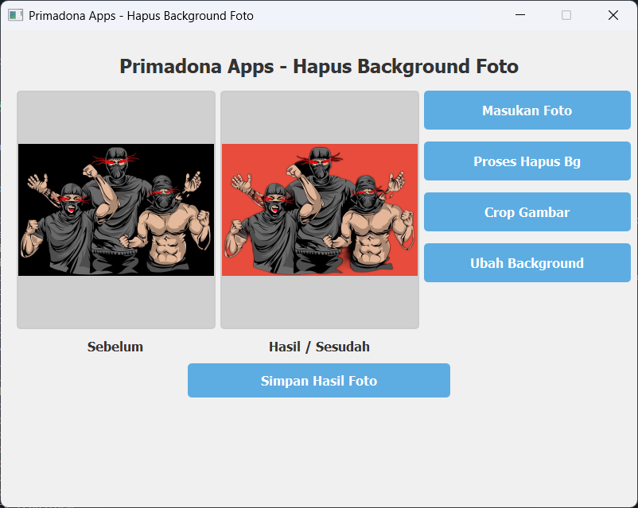

# Primadona Apps - Background Remover

<div align="center">


Aplikasi desktop untuk menghapus background foto secara otomatis menggunakan AI dengan antarmuka yang mudah digunakan.

[Features](#-features) " [Installation](#-installation) " [Usage](#-usage) " [Building](#-building-executable) " [Windows 7](#-windows-7-compatibility)

</div>

---

## =� Screenshot



## ( Features

- **> AI-Powered Background Removal** - Menggunakan AI model untuk hasil yang akurat
- ** Image Cropping** - Crop gambar dengan berbagai aspect ratio (Free, 4x6, 3x4, 2x3, 1x1)
- **<� Background Replacement** - Ganti background dengan warna solid (Merah, Kuning, Biru, Abu-abu)
- **=� Multiple Format Support** - Simpan hasil dalam PNG atau JPEG
- **� Fast Processing** - Proses cepat dengan splash screen yang informatif
- **=� Windows 7 Compatible** - Mendukung Windows 7 64-bit ke atas
- **<� User-Friendly Interface** - Antarmuka yang intuitif dan mudah digunakan

## <� Use Cases

- Foto pas untuk dokumen (KTP, SIM, Paspor)
- Foto produk untuk e-commerce
- Foto profil media sosial
- Editing foto casual
- Dan lainnya...

## =� Requirements

### For Windows 10/11 (Development)
- Python 3.11+
- PyQt5 5.15.11
- rembg 2.0.67
- onnxruntime 1.15.1
- opencv-python 4.12.0
- See `requirements.txt` for complete list

### For Windows 7 64-bit
- Python 3.8.10 (Max version for Windows 7)
- PyQt5 5.15.9
- rembg 2.0.30
- onnxruntime 1.8.1 (Critical for Windows 7 compatibility)
- See `requirements_win7.txt` for complete list

## =� Installation

### Option 1: Download Executable (Recommended for End Users)

1. Download the latest release from [Releases](../../releases)
2. Extract the ZIP file
3. Run `Primadona_Background_Remover.exe`

### Option 2: Development Setup

```bash
# Clone the repository
git clone <repository-url>
cd removebg-desktop

# Create virtual environment
python -m venv venv

# Activate virtual environment
# Windows:
venv\Scripts\activate

# Install dependencies
pip install -r requirements.txt
```

### Option 3: Windows 7 Development Setup

```bash
# Install Python 3.8.10 from https://www.python.org/downloads/release/python-3810/

# Create virtual environment with Python 3.8
py -3.8 -m venv venv38

# Activate virtual environment
venv38\Scripts\activate

# Install Windows 7 compatible dependencies
pip install -r requirements_win7.txt
```

## =� Usage

### Running from Source

```bash
# Activate virtual environment
venv\Scripts\activate  # or venv38\Scripts\activate for Windows 7

# Run the application
python main.py
```

### Basic Workflow

1. **Masukan Foto** - Click to select an image (opens in Downloads folder by default)
2. **Proses Hapus Bg** - Remove background automatically using AI
3. **Crop Gambar** (Optional) - Crop the image with desired aspect ratio
4. **Ubah Background** (Optional) - Add solid color background
5. **Simpan Hasil Foto** - Save the result (defaults to Downloads folder)

## =( Building Executable

### For Windows 10/11

```bash
# Activate virtual environment
venv\Scripts\activate

# One-file executable (slower startup, single file)
pyinstaller --clean -y spec/build_config.spec

# One-folder executable (faster startup, with splash screen)
pyinstaller --clean -y spec/build_config_onedir.spec
```

**Output:** `dist/Primadona_Background_Remover/`

### For Windows 7 64-bit

```bash
# Activate Windows 7 virtual environment
venv38\Scripts\activate

# Build Windows 7 compatible version
pyinstaller --clean -y spec/build_config_win7.spec
```

**Output:** `dist/Primadona_Background_Remover_Win7/` (~491MB)

## >� Windows 7 Compatibility

### Critical Requirements

1. **Python 3.8.10** - Python 3.9+ does NOT support Windows 7
2. **onnxruntime 1.8.1** - Newer versions don't work on Windows 7
3. **Windows 7 SP1 64-bit** - With all updates installed
4. **Visual C++ Redistributable 2015-2019** - Required for onnxruntime

### Known Limitations on Windows 7

- Slightly larger executable size due to older dependencies
- Some newer Python features not available

### Troubleshooting Windows 7

If you get DLL errors:
1. Install Visual C++ Redistributable: `vc_redist.x64.exe`
2. Ensure Windows 7 is updated with SP1
3. Check Python version: `python --version` (must be 3.8.x)

## =� Project Structure

```
removebg-desktop/

