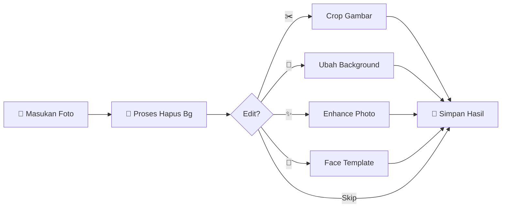

<h1 align="center">
  
  Primadona Apps - Background Remover
  
</h1>

<div align="center">


### ✨ Hapus Background Foto dengan AI - Cepat, Mudah, & Gratis! ✨


<br/>

**Aplikasi desktop untuk menghapus background foto secara otomatis menggunakan AI**  
**dengan antarmuka yang mudah digunakan dan hasil yang profesional!**

<br/>

 • [📥 Installation](#-installation) • [💡 Usage](#-usage) • [🔨 Building](#-building-executable) • [🪟 Windows 7](#-windows-7-compatibility)

<br/>


</div>

---

## 📸 Screenshot


## Features

- **AI-Powered Background Removal** - Menggunakan AI model untuk hasil yang akurat
- **Image Cropping** - Crop gambar dengan berbagai aspect ratio (Free, 4x6, 3x4, 2x3, 1x1)
- **Background Replacement** - Ganti background dengan warna solid (Merah, Kuning, Biru, Abu-abu)
- **Multiple Format Support** - Simpan hasil dalam PNG atau JPEG
- **Fast Processing** - Proses cepat dengan splash screen yang informatif
- **Windows 7 Compatible** - Mendukung Windows 7 64-bit ke atas
- **User-Friendly Interface** - Antarmuka yang intuitif dan mudah digunakan

## 🎯 Use Cases

<div align="center">

 
**Cocok untuk semua kebutuhan foto Formal Anda!** 


</div>

## 📋 Requirements

<table>
<tr>
<td width="50%">

### 🪟 For Windows 10/11 (Development)


```yaml
Core Dependencies:
  🤖 rembg: 2.0.67
  ⚙️ onnxruntime: 1.15.1
  📷 opencv-python: 4.12.0
  🖼️ Pillow: Latest
  🎨 PyQt5: 5.15.11
```

> 📄 See `requirements.txt` for complete list

</td>
<td width="50%">

### 🪟 For Windows 7 64-bit


```yaml
Core Dependencies:
  🤖 rembg: 2.0.30
  ⚙️ onnxruntime: 1.8.1 ⚠️
  📷 opencv-python: Compatible
  🖼️ Pillow: 9.5.0
  🎨 PyQt5: 5.15.9
```

> 📄 See `requirements_win7.txt` for complete list
> ⚠️ Critical for Windows 7 compatibility

</td>
</tr>
</table>

## 📥 Installation

<details open>
<summary><b>🚀 Option 1: Download Executable (Recommended)</b></summary>

<br/>

**Perfect untuk pengguna yang ingin langsung pakai!**

```diff
+ 1. 📦 Download latest release from Releases
+ 2. 📂 Extract ZIP file
+ 3. ▶️ Run Primadona_Background_Remover.exe
+ 4. ✨ Done! Enjoy!
```

<div align="center">

<b>No installation needed!</b>

</div>

</details>

<details>
<summary><b>🛠️ Option 2: Development Setup (Windows 10/11)</b></summary>

<br/>

**Untuk developer yang ingin kontribusi atau modifikasi!**

```bash
# 📥 Clone repository
git clone <repository-url>
cd removebg-desktop

# 🐍 Create virtual environment
python -m venv venv

# ⚡ Activate virtual environment (Windows)
venv\Scripts\activate

# 📦 Install dependencies
pip install -r requirements.txt

# 🚀 Run application
python main.py
```

<div align="center">

</div>

</details>

<details>
<summary><b>🪟 Option 3: Windows 7 Development Setup</b></summary>

<br/>

**Special setup untuk Windows 7 users!**

```bash
# 📥 Download & Install Python 3.8.10
# Link: https://www.python.org/downloads/release/python-3810/

# 🐍 Create virtual environment with Python 3.8
py -3.8 -m venv venv38

# ⚡ Activate virtual environment
venv38\Scripts\activate

# 📦 Install Windows 7 compatible dependencies
pip install -r requirements_win7.txt

# 🚀 Run application
python main.py
```

<div align="center">

</div>

</details>

## 💡 Usage

### 🏃 Running from Source

```bash
# ⚡ Activate virtual environment
venv\Scripts\activate  # or venv38\Scripts\activate for Windows 7

# 🚀 Run the application
python main.py
```

### 📝 Basic Workflow

<div align="center">



</div>

<br/>

<table>
<tr>
<td align="center" width="20%">

<br/><b>1. Masukan Foto</b>
<br/><sub>Select your image</sub>
</td>
<td align="center" width="20%">

<br/><b>2. Proses AI</b>
<br/><sub>Remove background</sub>
</td>
<td align="center" width="20%">

<br/><b>3. Crop</b>
<br/><sub>Optional cropping</sub>
</td>
<td align="center" width="20%">

<br/><b>4. Background</b>
<br/><sub>Change color</sub>
</td>
<td align="center" width="20%">

<br/><b>5. Simpan</b>
<br/><sub>Save result</sub>
</td>
</tr>
</table>

<div align="center">

> 💡 **Pro Tip:** Default folder untuk open/save adalah Downloads!

</div>

## 🔨 Building Executable

<details>
<summary><b>🪟 For Windows 10/11</b></summary>

<br/>

### 📦 One-File Executable
*Slower startup, but everything in single file*

```bash
# ⚡ Activate virtual environment
venv\Scripts\activate

# 🔨 Build one-file executable
pyinstaller --clean -y spec/build_config.spec
```

**📤 Output:** `dist/Primadona_Background_Remover.exe`

---

### 📂 One-Folder Executable
*Faster startup with splash screen*

```bash
# ⚡ Activate virtual environment
venv\Scripts\activate

# 🔨 Build one-folder executable
pyinstaller --clean -y spec/build_config_onedir.spec
```

**📤 Output:** `dist/Primadona_Background_Remover/`

<div align="center">

</div>

</details>

<details>
<summary><b>🪟 For Windows 7 64-bit</b></summary>

<br/>

```bash
# ⚡ Activate Windows 7 virtual environment
venv38\Scripts\activate

# 🔨 Build Windows 7 compatible version
pyinstaller --clean -y spec/build_config_win7.spec
```

**📤 Output:** `dist/Primadona_Background_Remover_Win7/` (~491MB)

<div align="center">


</div>

</details>

## 🪟 Windows 7 Compatibility

<div align="center">

### ⚠️ Critical Requirements

</div>

<table>
<tr>
<td width="25%" align="center">

<br/><b>Python 3.8.10</b>
<br/><sub>⚠️ 3.9+ NOT supported</sub>
</td>
<td width="25%" align="center">

<br/><b>onnxruntime 1.8.1</b>
<br/><sub>⚠️ Newer versions fail</sub>
</td>
<td width="25%" align="center">

<br/><b>Windows 7 SP1 64-bit</b>
<br/><sub>✓ All updates installed</sub>
</td>
<td width="25%" align="center">

<br/><b>VC++ Redist 2015-2019</b>
<br/><sub>✓ Required runtime</sub>
</td>
</tr>
</table>

---

### ⚙️ Known Limitations

<div align="center">

| ⚠️ Limitation | 📝 Description |
|:---:|:---|
| 📦 **File Size** | Slightly larger executable (~491MB) due to older dependencies |
| 🐍 **Python Features** | Some newer Python 3.9+ features not available |
| ⚡ **Performance** | May be slightly slower on older hardware |

</div>

---

### 🔧 Troubleshooting Windows 7

<details>
<summary><b>❌ Getting DLL Errors?</b></summary>

<br/>

```diff
! Common Error: "The program can't start because xxx.dll is missing"
```

**Solution Steps:**

1. **📥 Install Visual C++ Redistributable**
   ```
   Download: vc_redist.x64.exe
   Link: Microsoft Visual C++ 2015-2019 Redistributable
   ```

2. **🔄 Update Windows 7**
   ```
   - Ensure SP1 is installed
   - Install all Windows Updates
   - Reboot system
   ```

3. **✅ Verify Python Version**
   ```bash
   python --version
   # Must show: Python 3.8.x
   ```

<div align="center">

</div>

</details>

## 📁 Project Structure

```
📦 removebg-desktop/
├── 📄 main.py                    # 🚀 Application entry point
├── 📄 app.py                     # 🎨 Main application class
├── 📄 requirements.txt           # 📋 Dependencies (Win 10/11)
├── 📄 requirements_win7.txt      # 📋 Dependencies (Win 7)
├── 📁 ui/                        # 🖼️ User Interface
│   ├── 📄 main_window.py        # 🪟 Main window
│   ├── 📄 widgets.py            # 🎛️ Custom widgets
│   ├── 📄 crop_dialog.py        # ✂️ Crop functionality
│   ├── 📄 background_dialog.py  # 🎨 Background changer
│   ├── 📄 enhance_dialog.py     # ✨ Photo enhancement
│   └── 📄 face_template_dialog.py # 👤 Face template
├── 📁 utils/                     # 🛠️ Utilities
│   └── 📄 image_processor.py    # 🤖 AI processing
├── 📁 spec/                      # 📦 Build configurations
│   ├── 📄 build_config.spec     # ⚙️ One-file build
│   ├── 📄 build_config_onedir.spec # ⚙️ One-folder build
│   └── 📄 build_config_win7.spec # ⚙️ Windows 7 build
├── 📁 assets/                    # 🖼️ Resources
│   └── 📷 screenshot.png        # 📸 App screenshot
├── 📁 templates/                 # 👔 Face templates
└── 🎨 icon.ico                  # 🪟 App icon

